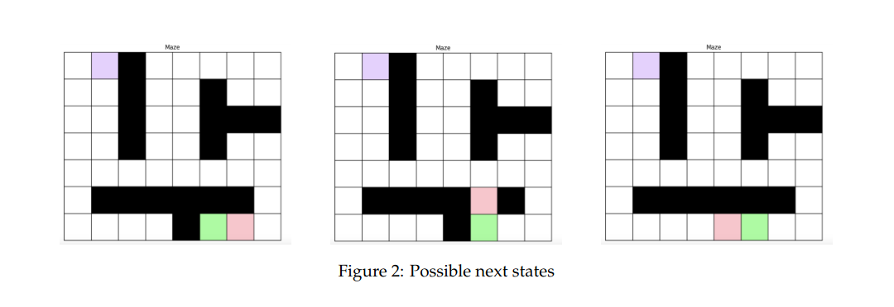
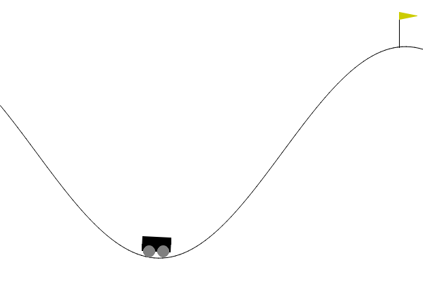

# Human gaming skills are weak. Use neural networks
This repo presents some RL algorithms to solve gymnasium games like moon landing or the mountain car available at https://gymnasium.farama.org/. I also solve a problem of escaping a maze while being followed by a hungry Minotaur.

These where made with the help of Farouk MILED for the KTH course EL2805 Reinforcement Learning given by Pr. Alexandre Proutière. 

## Escaping the maze
In this game, you are in a maze pursued by a minotaur. You cannot climb the walls, but the minotaur can and will. You (purple) must go to the exit (green) without getting catch by the minotaur (red). In some variants, the minotaur can not stay in place, in others, it can and 

This problem is rather simple and doesn't necessite expensive tools such as neural networks or Q-learning to be solve, and in a few iterations a solution based on Bellman's equation 

$V^*(s) = \max_{a} \sum_{s'} P(s'|s,a) \left[ R(s,a,s') + \gamma V^*(s') \right]$

This is first done with dynamic programming which ensure a success in almost all the cases if the lifespan of the player allows him to reach the exit. We then implement Police Iteration and Value Iteration with a great success rate. However, these algorithm become irrelevant if the number of states grows large or if there is a big time limit. For this reason, we then implement Q-learning, an off-policy algorithm and SARSA, which is on-policy. Both algorithm are working even with some convergence problem for SARSA

## Moon landing
Created by Oleg Klimov, this little game impose the agent to land between two flags with a lunar lander. The agent can command the thrust from the bottom, left and right side of the spaceship. We solved the discrete version of this with Deep Q-learning and the continuous one with DDPG. We implemented PPO but weren't able to make it properly converge. Deep Q-learning is pertinient when the state function is too complicated to learn and has to be approximated. There are multiple ways to do it *cf under*, but the current solution is to use the approximation power of neural nets.

## Mountain Car
The mountain car is another game from the gymnasium library where a car has to reach the top of a sinusoidal hill. The action space is discrete: *left, right, nothing*. Getting the $Q$ function is quite complicated here and there is a clear need to approximate it. We used linear approximation with Fourier basis of order 2, and then implemented the SARSA($\lambda$) algorithm with SGD and Nesterov acceleration. This work was heavily inspired from this paper: *George Konidaris, Sarah Osentoski, and Philip Thomas. Value function approximation in reinforcement learning using the fourier basis. In Proceedings of the AAAI conference on artificial
intelligence, volume 25, pages 380\u2013385, 2011.*
